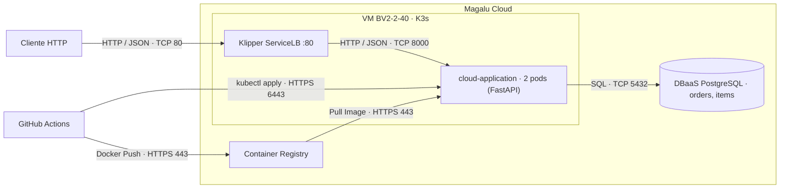

# Arquitetura da Solução

## Visão geral

API de pedidos containerizada, rodando em um cluster K3s (nó único) numa VM
na Magalu Cloud, com banco PostgreSQL gerenciado externo, imagens no Container
Registry e deploy automatizado pelo GitHub Actions.

## Diagrama C2 · Container

# Arquitetura da Solução

## Visão Geral

API de pedidos containerizada, rodando em um cluster K3s (nó único) numa VM na Magalu Cloud, com banco PostgreSQL gerenciado externo, imagens no Container Registry e deploy automatizado pelo GitHub Actions.

## Diagrama C2 · Container

## Componentes

| Componente | Serviço MGC | Função |
|------------|-------------|--------|
| API | K3s (VM single node) — 2 réplicas | Processa as requisições HTTP |
| Banco de dados | DBaaS PostgreSQL | Persiste pedidos e itens |
| Imagens | Container Registry | Armazena versões da aplicação |
| Tráfego externo | Klipper ServiceLB (IP da VM, porta 80) | Distribui entre as réplicas e dá acesso externo |
| CI/CD | GitHub Actions | Automatiza testes, build e deploy |

## Requisitos não-funcionais

| Requisito | Como medir | Alvo |
|---|---|---|
| Disponibilidade | Erros 5xx e uptime das probes no Grafana | 99,5% mensal |
| Latência | `histogram_quantile(0.95, ...)` do `/metrics` | P95 < 500 ms |
| Escalabilidade | Teste de carga (k6) + `rate(http_requests_total)` | 300 req/s sem degradar |
| Custo | VM + DBaaS + IP na calculadora MGC | Teto definido em ADR |

## Estilo arquitetural

A solução é um **monolito em camadas** (apresentação → serviço → dados),
implantado como container único com duas réplicas. O estilo-alvo, caso o
domínio de notificações cresça, seria extrair um segundo serviço — um próximo
passo, não uma decisão desta entrega.

## Trade-offs das decisões

| Aspecto | Decisão tomada | Alternativa não escolhida | Motivo da escolha |
|---------|---------------|--------------------------|-------------------|
| Deploy | K3s em VM | MKS (Kubernetes Gerenciado) | Custo menor, provisionamento < 2 min, manifests idênticos |
| Banco | DBaaS gerenciado | PostgreSQL em container | Backup automático, sem administração |
| CI/CD | GitHub Actions | Deploy manual | Consistência e rastreabilidade |
| Réplicas | 2 pods | 1 pod | Disponibilidade mínima sem custo excessivo |
| API | FastAPI (Python) | Node.js, Go, Java | Curva de aprendizado baixa, alta produtividade |

## Pontos de melhoria e próximos passos

| Melhoria | Por quê |
|----------|---------|
| HTTPS / TLS | Toda API em produção deve ser acessada por HTTPS |
| Autoscaler (HPA) | Escala o número de réplicas automaticamente conforme a carga de CPU |
| Versionamento de API (`/v1/orders`) | Evoluir sem quebrar clientes existentes |
| Rate limiting | Evita abuso e protege o banco de sobrecargas |
| Migrações de schema (Alembic) | Controle de versão das mudanças no banco |
| Testes de carga (k6) | Valida o comportamento sob alto tráfego |
| Migrar para MKS | Quando precisar de HA real: como os manifests são idênticos, basta trocar o kubeconfig |

